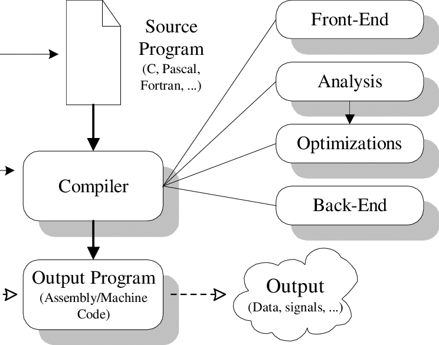
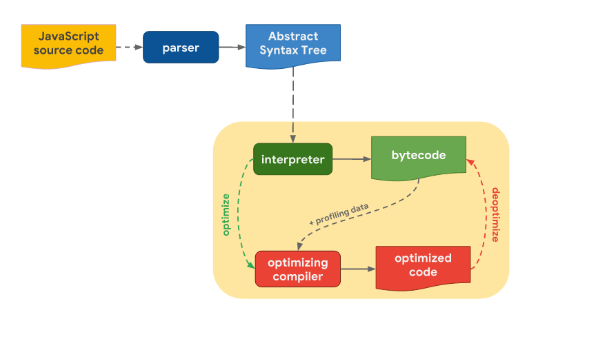

# Compilers and Interpreters intuitively

# Introduction

In this article we will talk about interpreters and compilers at an intuitive level and how is JS interpreted and JIT compiled.

# Compilers

A compiler is like a mapper that maps an input string (programming language) into an output string so that it can be executed later like:

- C++ → Assembly.
- Java → Bytecode.
    
    
    

Now that we know what a compiler is and what it does, how about we dive deep into how it works and see in detail what happens from the inside?

The compilation runs through 6 steps:

1. ***Lexical Analysis:*** This step takes the source code (input string) and split it into a series of tokens. This stage can work both like a lexer and a tokenizer, with the lexer doing the same job as a tokenizer but giving more information about the token if it’s a number or a string.
2. ***Syntax Analysis:*** In this stage, the compiler generates a structure called an abstract syntax tree (AST) out of the tokens that were generated from the previous step, which is a tree that represents the overall structure of the program. This step aims to check for any syntax error so the compiler can either stop and give an error message or continue to the next step.
3. ***Semantic Analysis:*** This stage of the compilation takes the abstract syntax tree generated from the previous step to detect if there is any semantic error, like assigning wrong variable types or assigning two variables with the same name in the same scope. The semantic analysis runs through three steps:
    1. **Type checking:** Inspects the types in variable assignments, functions, and method calls.
    2. **Flow control checking:** It checks if flow control structures are used correctly and if classes and objects are accessed correctly.
    3. **Label checking:** Validates the use of labels and identifiers.
4. ***Intermediate Code generation:*** During the compilation process, a compiler generates one more intermediate code which is machine independent thus it does not require different compilers for different machines, in addition, the optimization stage is easier to apply to intermediate code rather than low-level language such as machine code. 
5. ***Optimization:*** In this stage, the compiler focuses on enhancing the efficiency of the intermediate code using different methods, and following certain rules that focus on boosting the speed of the operation while using fewer resources without changing the meaning of the source code, plus it shouldn’t significantly affect the time of compilation.
6. ***Code Generation:*** After all the previous stages the compiler transforms the optimized intermediate code to machine code that is best to run on the target machine (your windows system), furthermore the final resulting code should have the same meaning as the source code, and it should be efficient in terms of memory and CPU usage.

# Interpreters

An interpreter is a computer program that executes a programing language directly without the need for compilation, it translates the high-level language into intermediate-level language that it executes, or it could parse the high-level language and executes the language statement by statement.

JavaScript is considered an interpreted language but modern browsers now use a technique known as just-in-time compilation to run the language faster, which we will explore in the next section.

# Just-in-time Compilation

JIT or Just in time compilation is a technique that came out to help run JS faster by compiling certain parts of your code and then executing that compiled part.

JS is an interpreted language that runs through the parser step then it generates an AST that goes through the interpreter to get translated into Byte Code to be executed, that’s the flow of JS, now let us see where the JIT part comes in.

After the generation of the AST, the interpreter goes through it and generates Byte code so that it can be executed, then the interpreter will use something called an accumulator that stores/read the values that will help later on in the optimizing compiler in the type detection step making it easier for the optimizing compiler to compile and optimize the code.

JIT comes after the code enters the interpreter, it will keep track of each line in the code and mark it as warm or hot depending on how many times it got called or executed, we call this part of the JIT structure the profiler, in case of the code is marked as warm, JIT will move onto the baseline compiler and compile that code in runtime without applying optimizations, in case of the code being marked as hot it will enter the optimizing compiler which is as the name suggests optimizes the compiled code that is generated.

The monitor: This part of the JIT structure is the most essential in JIT, it will keep track of the hot/warm code and if it sees that the code is being executed with the same variable type it will pull out the baseline compiled version or the optimized compiled version to be executed instead.

The final version of the code will be called optimized code and it’s built through assumptions that the optimizing compiler made through run time, if at some point any assumption was wrong it will deoptimize the code going back to the interpreted version, meaning that JIT has a fallback emergency in case of any mistakes so that it can correct the assumptions fixing those mistakes.

# Sources:

1. [https://blog.bitsrc.io/the-jit-in-javascript-just-in-time-compiler-798b66e44143](https://blog.bitsrc.io/the-jit-in-javascript-just-in-time-compiler-798b66e44143)
2. [https://webkit.org/blog/3362/introducing-the-webkit-ftl-jit/](https://webkit.org/blog/3362/introducing-the-webkit-ftl-jit/)
3. [https://www.baeldung.com/cs/how-compilers-work](https://www.baeldung.com/cs/how-compilers-work)
4. [https://www.techopedia.com/definition/7793/interpreter](https://www.techopedia.com/definition/7793/interpreter)